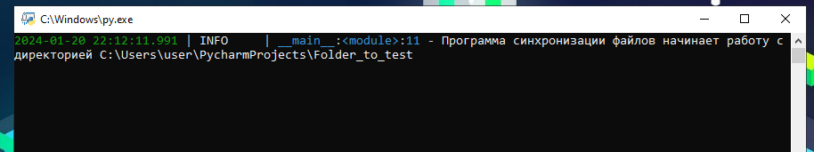

# Система синхронизации файлов
## Описание
Данная программа, используя API Яндекс Диска, в автоматическом режиме собирает информацию о файлах в указаной директории
и дублирует их облако.  
  
Для загрузки новых или удаления отсутствующих ей достаточно проверить их наличие\отсутствие
в обоих хранилищах.
Для работы же с одинаковыми названиями файлов - вычисляет их хеш-сумму sha256 и также сравнивает оба списка.  
  
Не поддерживает работу с папками, только с файлами.

При желании, можно переделать под любое другое облачное хранилище.
Весь основной функционал содержится в отдельных директориях ``synchronization`` и ``local_files``.
Для работы с облаком - только в ``api``.
# Начало работы

## Установка
Помимо клонирования репозитория, нужно установить несколько сторонних библиотек,
без которых программа просто не запустится:
+ python-dotenv
+ requests
+ loguru
```python
pip install python-dotenv
pip install requests
pip install loguru
```

## Настройка конфигурационного файла
Для работы программы нужно создать файл ``.env``, в котором будут содержаться основные настройки.
Шаблон находится в файле ``.env.template``.

### Токен (TOKEN)
Для доступа к файлам на Яндекс Диске необходимо указать свой токен.  
Его можно скопировать на [Полигоне Яндекс Диска](https://yandex.ru/dev/disk/poligon)


### Путь к локальной папке
Необходимо указать абсолютный путь к папке, которая будет отслеживаться. В ней не должно быть папок.


### Путь к папке на Яндекс Диске
Необходимо указать путь и/или имя папки на своем Яндекс Диске.


### Интервал времени
Данная настройка будет регулировать частоту проверки файлов из обоих хранилищ.

### Итог
После выполнения всех действий файл ``.env`` должен выглядеть примерно также, как на скриншоте.


## Использование
Для старта работы достаточно запустить файл ``main.py``  
Все логи сохраняются в файле ``logs.log``

