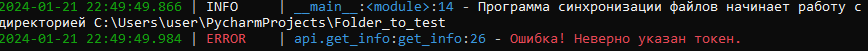
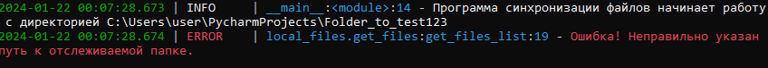
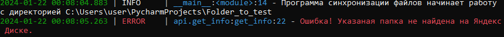
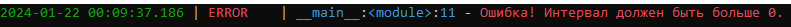

# Система синхронизации файлов
## Описание
Данная программа, используя API Яндекс Диска, в автоматическом режиме собирает информацию о файлах в указанной директории
и дублирует их в облако.  
  
Для загрузки новых или удаления отсутствующих ей достаточно проверить их наличие\отсутствие
в обоих хранилищах.
Для работы же с одинаковыми названиями файлов - вычисляет их хеш-сумму sha256 и также сравнивает оба списка.

При желании можно переделать под любое другое облачное хранилище.
Весь основной функционал содержится в отдельных директориях ``synchronization`` и ``local_files``.
Для работы с облаком - только в ``api``.  
  
Не поддерживает работу с папками, только с файлами.
#### Осторожно!
В программе, пока что, не реализована работа с ``.zip`` архивами.
При их попадании в отслеживаемую папку программа начинает работать крайне нестабильно и 
"тормозит" весь компьютер.
# Начало работы

## Установка
Помимо клонирования репозитория нужно установить несколько сторонних библиотек,
без которых программа просто не запустится:
+ python-dotenv
+ requests
+ loguru
```python
pip install python-dotenv
pip install requests
pip install loguru
```

## Настройка конфигурационного файла
Для работы программы нужно создать файл ``.env``, в котором будут содержаться основные настройки.
Шаблон находится в файле ``.env.template``.

### Токен (TOKEN)
Для доступа к файлам на Яндекс Диске необходимо указать свой токен.  
Его можно скопировать на [Полигоне Яндекс Диска](https://yandex.ru/dev/disk/poligon) (см. скриншот ниже)


### Путь к локальной папке (FILE_PATH)
Необходимо указать абсолютный путь к папке, которая будет отслеживаться. В ней не должно быть папок. (см. скриншот ниже)


### Путь к папке на Яндекс Диске (DISK_PATH)
Необходимо указать путь и/или имя папки на своем Яндекс Диске. (см. скриншот ниже)


### Интервал времени (INTERVAL)
Данная настройка будет регулировать частоту проверки файлов из обоих хранилищ.
Требуется указать время в __секундах__, *в строковом формате*.

### Итог
После выполнения всех действий файл ``.env`` должен выглядеть примерно также, как на скриншоте. (см. скриншот ниже)  


# Использование

## Запуск

### main.py
Для старта работы достаточно запустить файл ``main.py``  (см. скриншот ниже)


## Ход работы
Во время работы программа будет выдавать только сообщения, описывающие проделанное действие.

#### Запись файла

#### Удаление файла

#### Замена файла (перезапись)

## Возможные ошибки

### Ошибки в конфигурационном файле

При неправильно указанных параметрах программа выведет соответствующее сообщение, сохранит его в логах
и закроется через 5 сек.
#### Неправильный токен

#### Неправильный путь к локальной папке

#### Неправильный путь к папке на Диске

#### Неправильно указано время


### Ошибки в ходе работы

При возникновении ошибок в ходе работы программы, она не прекращает свою работу
и делает соответствующие записи в логах.
#### Недостаточно свободного места

#### Отсутствует подключение к интернету


Также помимо выше перечисленных можно встретить еще несколько редких ошибок:  
+ __Файл слишком большой__  
Может возникнуть, если тариф на Диске не позволяет загружать слишком большие файлы.
+ __Ошибка соединения__  
+ __Не удалось загрузить данные с сервера__  
Обе эти ошибки появляются в случае, если сервер по каким-либо причинам не дал ответ.
+ __Ведутся технические работы__  
Во время технических работ возможно только скачивание и просмотр
файлов.

## Логи

Все логи сохраняются в файле ``logs.log`` в реальном времени, без ограничений.

